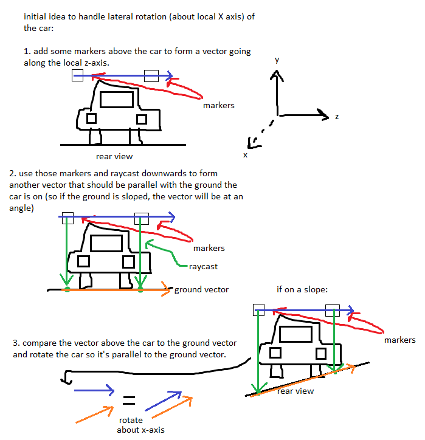

# car demo    
    
For this project I originally just wanted to make a car and display it but then I decided to go further and explore car movement on an angled track.    
    
## notes:    
    
1. Getting the car tilted the right way on an angled road
    
One challenge was getting the car to tilt correctly when it was on a sloped part of the road. I had to adjust the lateral angle of the car (left-to-right) as well as the forward/backward (longitudinal?) tilt angle.    
Below is a sketch of my idea to solve this (it shows the lateral angle but the same idea is applied to the forward/backward angle, just on a different axis).    
    
    
    
You can see below some of the lines I drew to help debug. The cyan and red lines are normal vectors of the car model and of the face of the track model that the car was on. I tried to solve the problem using normal vectors but that didn't work out for me, but I left them in because it looks cool :).    
    
    	
    
    	
    
2. Turning the car based on the front wheels' angle
    
Another fun problem is getting the car model to turn based on the angle of the front wheels. Initially I thought I could just rotate the car model a bit when the front wheels are angled, which sort of works.    
I also found this amazingly helpful page (https://asawicki.info/Mirror/Car%20Physics%20for%20Games/Car%20Physics%20for%20Games.html), which I think helped me calculate a better amount to rotate my car when the front wheels are turned.    
One issue that still stands is that when turning the wheels quickly the car movement is not realistic, possibly because I'm rotating the whole car, which includes the front wheels, when the front wheels are already angled.    